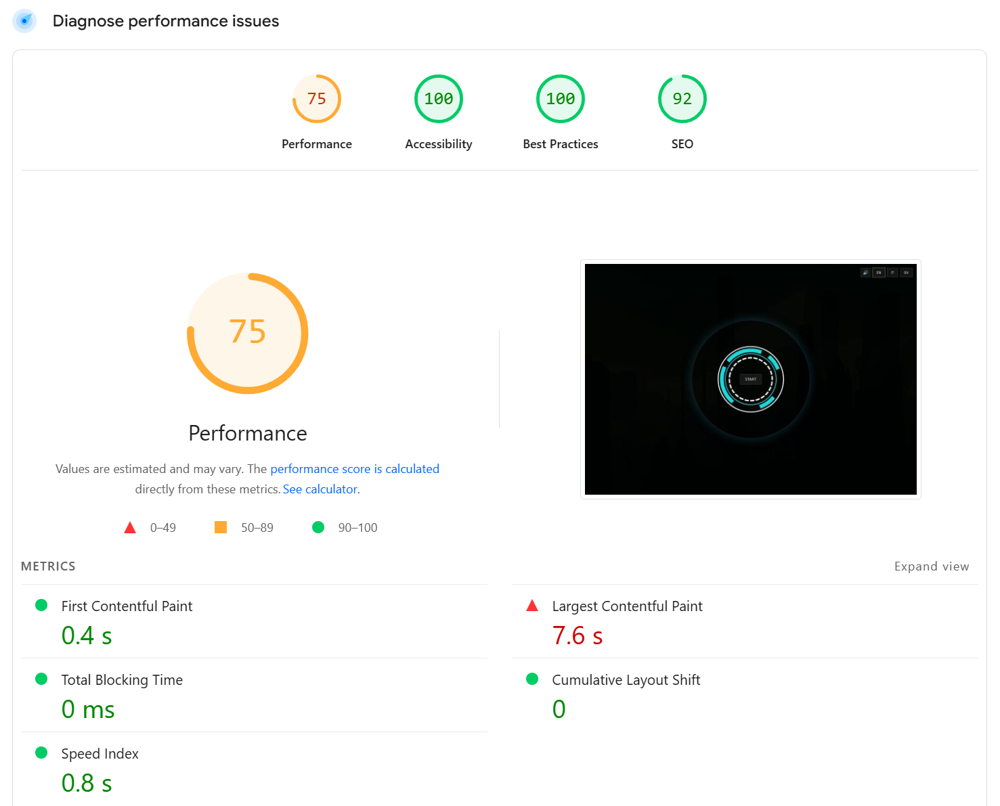
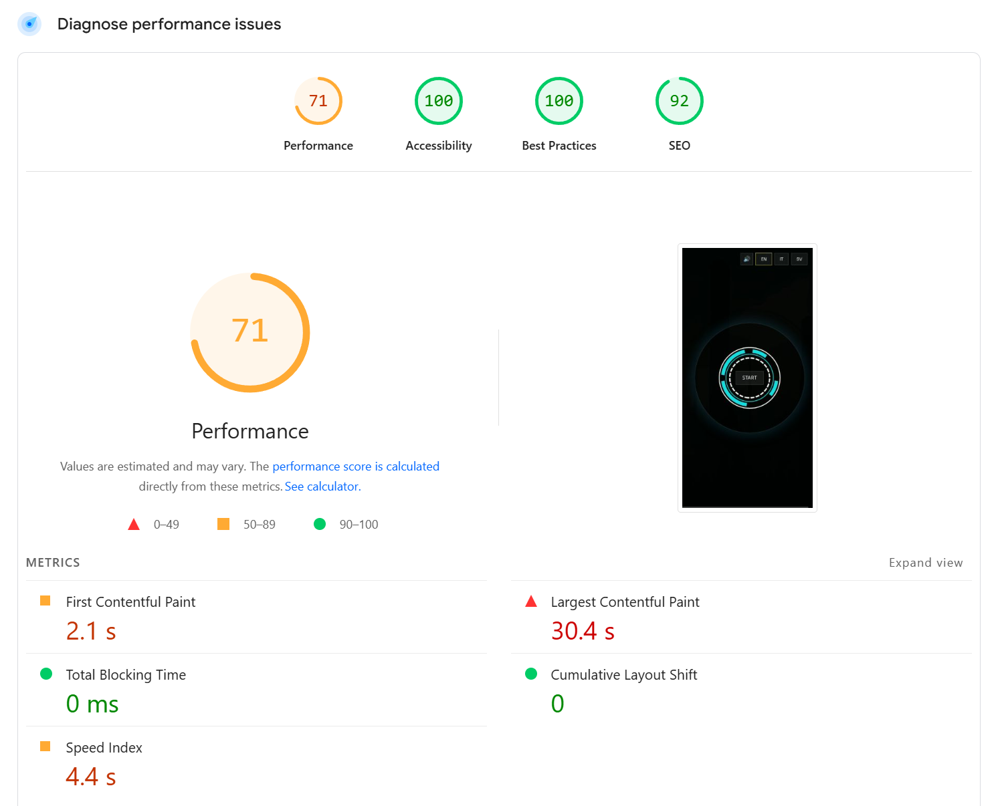

# Adina - Digital Services  —  React + Vite + Tailwind v4

<p align="center">
  <a href="https://nodejs.org/">
    =18" src="https://img.shields.io/badge/Node-%E2%89%A518-339933?logo=node.js&logoColor=white">
  </a>
  <a href="https://react.dev/">
    
  </a>
  <a href="https://vitejs.dev/">
    
  </a>
  <a href="https://tailwindcss.com/">
    
  </a>
  <a href="https://reactrouter.com/">
    
  </a>
  
</p>

A neon/cyberpunk portfolio with an animated intro, **radial menu**, reusable **modals**, **i18n** (EN/IT/SV), a dedicated **Blog** page, and subtle FX (scanlines, iris, glitch). Built for clean structure, accessibility, and performance.

---

## Table of Contents

- [Features](#features)
- [Tech Stack](#tech-stack)
- [Quick Start](#quick-start)
- [Project Structure](#project-structure)
- [Configuration](#configuration)
  - [Vite alias `@`](#vite-alias-)
  - [Tailwind v4 (no init)](#tailwind-v4-no-init)
  - [Fonts](#fonts)
- [Routing](#routing)
- [Internationalization (i18n)](#internationalization-i18n)
- [Key Components](#key-components)
- [Accessibility](#accessibility)
- [Responsive Behavior](#responsive-behavior)
- [Scripts](#scripts)
- [Deployment](#deployment)
- [Troubleshooting](#troubleshooting)
- [License](#license)

---

## Features

- **IntroGate** → **ScreenWipe** (scanlines + iris) → **RadialMenu**
- **Reusable Modal** with focus trap, `inert`, ESC to close
- **Pages**: About, Services, Contact (modals) + **Blog** (full page)
- **i18n** with simple `locales.js` (EN/IT/SV) and `useI18n()`
- **SFX-ready** via `SfxProvider` (with mute toggle)
- **Footer** with glass UI, responsive marquee, status bar
- **Tailwind v4**: theme tokens via `@theme` + component utilities (`.btn`, `.glass`, `.chip`)
- Import alias **`@`** for clean paths
- Variable fonts (Oxanium / Space Grotesk / JetBrains Mono)

---

## Tech Stack

- **React** + **Vite**
- **Tailwind CSS v4** (via `@import "tailwindcss"`, no `tailwind init`)
- **react-router-dom**
- **@fontsource-variable** fonts

---

## Quick Start

> **Requirements:** Node.js **>= 18**

```bash
# Install dependencies
npm i

# Start dev server
npm run dev

# Build for production
npm run build

# Preview local build
npm run preview
```

---

## Configuration
Vite alias @

vite.config.js:

```bash
import { defineConfig } from "vite";
import react from "@vitejs/plugin-react";
import path from "path";

export default defineConfig({
  plugins: [react()],
  resolve: {
    alias: { "@": path.resolve(__dirname, "./src") },
  },
});
```

```bash
(Optional for editor IntelliSense) jsconfig.json:

{
  "compilerOptions": {
    "baseUrl": ".",
    "paths": { "@/*": ["src/*"] }
  }
}
```

After changing vite.config.js, restart the dev server.

---

## Tailwind v4 (no init)

We use Tailwind v4 via direct import and theme tokens:

src/index.css


```bash
@import "tailwindcss";
@import "flag-icons/css/flag-icons.min.css";
@import "@fontsource-variable/oxanium";
@import "@fontsource-variable/space-grotesk";
@import "@fontsource-variable/jetbrains-mono";

/* Fonts & theme tokens */
@theme {
  --font-sans: "Space Grotesk", system-ui, -apple-system, "Segoe UI", Roboto, "Helvetica Neue", Arial, "Noto Sans", "Apple Color Emoji","Segoe UI Emoji","Segoe UI Symbol";
  --font-mono: "JetBrains Mono", ui-monospace, SFMono-Regular, Menlo, Monaco, Consolas, "Liberation Mono", "Courier New", monospace;
  --font-display: "Oxanium", "Space Grotesk", system-ui, -apple-system, "Segoe UI", Roboto, Arial, sans-serif;

  --color-cyber-bg:   #00060e;
  --color-cyber-neon: #fee801;
  --color-cyber-azz:  #54c1e6;
  --color-cyber-turch:#39c4b6;
}

/* Base */
@layer base { body { @apply font-sans antialiased; } }

/* Component utilities */
@layer components {
  .glass { @apply rounded-2xl border border-white/20 bg-white/8 backdrop-blur-sm ring-1 ring-white/10 shadow-[0_0_45px_rgba(84,193,230,.25)]; }
  .chip  { @apply rounded-2xl border border-white/20 bg-white/8 backdrop-blur-sm; }
  .btn   { @apply rounded-2xl border border-white/20 bg-white/8 backdrop-blur-sm px-3 py-1.5 text-sm hover:bg-white/12 focus:outline-none focus:ring-2 focus:ring-cyber-neon/50; }
}

/* Stage transitions */
@keyframes fade-in  { 0%{opacity:0; transform:translateY(4px) scale(.985)} 100%{opacity:1; transform:translateY(0) scale(1)} }
@keyframes fade-out { 0%{opacity:1; transform:translateY(0)  scale(1)}    100%{opacity:0; transform:translateY(4px) scale(.985)} }
.animate-in  { animation: fade-in  .26s cubic-bezier(.22,.61,.36,1) both; }
.animate-out { animation: fade-out .20s cubic-bezier(.22,.61,.36,1) both; }

/* Stage layer: mobile-friendly scrolling */
.stage-layer{
  position:absolute; inset:0;
  display:grid; place-items:center;
  overflow-y:auto;
  -webkit-overflow-scrolling:touch;
  overscroll-behavior:contain;
  padding:1rem;
}
.min-h-svh { min-height: 100svh; }

/* (FX: scanlines / iris / glitch classes live here too) */
```

---

## Key Components

Stage — mount/unmount + enter/exit transitions (.animate-in / .animate-out)

ScreenWipe — overlay FX (mode="scan" | "iris" | "both") + onDone

RadialMenu — accessible SVG wedges; mobile fallback list

Modal — glass dialog with backdrop; ESC & click-out close; focus trap; sets inert on page

Footer — glass UI, marquee (hidden on mobile), faux uptime/ping

LanguageToggle / MuteToggle — compact controls

AboutPanel / ServicesPanel — i18n-driven content

## Accessibility

Use inert (boolean) on the page wrapper when the modal is open:
```bash
<div inert={modalOpen || undefined} className={modalOpen ? "pointer-events-none" : ""}>
```

Avoid aria-hidden on ancestors with focused elements (prevents Chrome warning).

Focus trap within modal (Tab/Shift+Tab).

ESC closes; backdrop click closes.

Respect prefers-reduced-motion:

@media (prefers-reduced-motion: reduce) {
  .animate-in, .animate-out { animation: none !important; }
}

## Responsive Behavior

Stage layers are scrollable on mobile (overflow-y:auto, min-h-svh)
Footer compact on small screens; marquee hidden < md
RadialMenu becomes a simple list on small screens

## Scripts

```bash
{
  "scripts": {
    "dev": "vite",
    "build": "vite build",
    "preview": "vite preview --open"
  }
}
```
---

## Screenshots & Highlights

- Key views of the application showcasing design and functionality.

<p align="center">
  
  
</p>

---

## Troubleshooting

- “Empty string for boolean attribute inert”
Use inert={modalOpen || undefined} (don’t spread { inert: "" }).

- Footer shows at the top
Ensure min-h-dvh flex flex-col on root, scene wrapper as flex-1, and a min height on the scene (min-h-[60vh]).

- Fonts not applied
Verify imports in index.css, @theme mappings, and usage of font-sans / [font-family:var(--font-display)].

- Alias @ not working
Check alias in vite.config.js and restart dev server; otherwise use relative imports.

## License

- **Code**: Proprietary – All Rights Reserved.  
  No use, copying, modification, or redistribution without explicit written permission.
- **Content (blog, images)**: CC BY-NC 4.0 (optional, if you want to allow non-commercial sharing).  
- Third-party assets (fonts, icons) retain their original licenses.

## Third-Party Licenses

This project includes third-party assets. Each retains its original license:

- **Oxanium** — *SIL Open Font License 1.1*  
  Authors: The Oxanium Project (Severin Meyer)  
  Source: https://github.com/sevmeyer/oxanium • License: https://www.fontsquirrel.com/license/oxanium

- **Space Grotesk** — *SIL Open Font License 1.1*  
  Author: Florian Karsten  
  Source: https://github.com/floriankarsten/space-grotesk • License: https://www.fontsquirrel.com/license/spacegrotesk

- **JetBrains Mono** — *SIL Open Font License 1.1*  
  Author: JetBrains  
  Source: https://github.com/JetBrains/JetBrainsMono • License: https://www.jetbrains.com/lp/mono/

- **flag-icons** — *MIT License*  
  Author: Panayiotis Lipiridis  
  Source: https://github.com/lipis/flag-icons • Homepage: https://flagicons.lipis.dev/

> Usage of these assets is subject to their respective licenses. Review upstream repositories for full terms.
